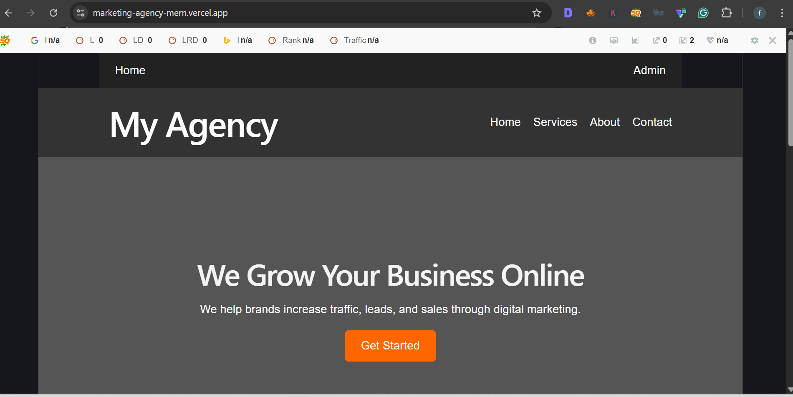
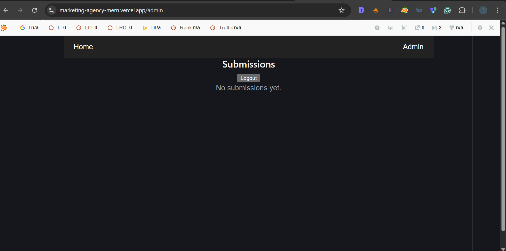

# Marketing Agency MERN App

A full-stack web application built with React, Node.js, Express, and MongoDB.  
It includes a marketing website, a contact form, and a JWT-protected admin dashboard to manage submissions.

## Live Demo

Frontend: https://marketing-agency-mern.vercel.app/  
Backend API: https://marketing-agency-mern.onrender.com

## Key Features

- Full-stack MERN application
- Responsive marketing website
- Contact form with real-time submission
- MongoDB database integration
- Admin dashboard with authentication
- JWT-based protected API routes
- Create, read, and delete submissions
- Deployed using Vercel and Render

## Project Structure

/client   → React frontend  
/server   → Express backend  
/models   → MongoDB schemas  

## Future Improvements

- Add edit/update functionality
- Add pagination for submissions
- Improve UI/UX design
- Add user authentication system
- Add rate limiting and security enhancements

## Tech Stack

- React
- Vite
- Node.js
- Express
- MongoDB Atlas
- Mongoose
- JWT
- Vercel
- Render

## Live Links

Frontend: your Vercel URL  
Backend: your Render URL

## API Routes

POST /contact  
POST /login  
GET /submissions  
DELETE /submissions/:id

## What I Learned

- React components
- State management
- API requests
- Backend routes
- MongoDB models
- Authentication
- Deployment

## Screenshots

### Home Page

### Admin Dashboard
